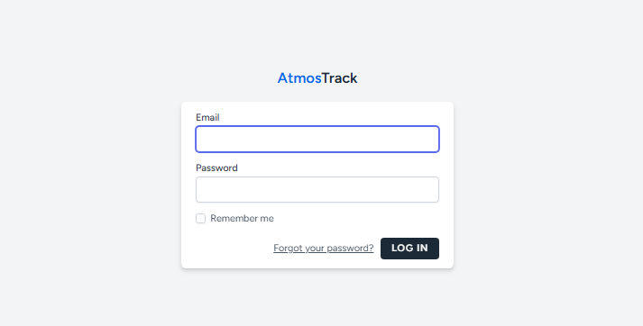
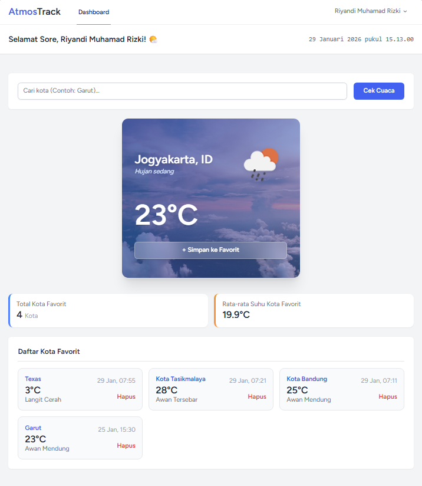
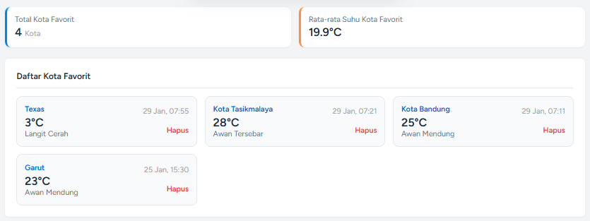

# AtmosTrack - Advanced Weather Dashboard

**AtmosTrack** adalah aplikasi monitoring cuaca berbasis web yang dibangun dengan framework **Laravel**. Aplikasi ini mengintegrasikan data cuaca real-time dengan visualisasi dinamis untuk memberikan pengalaman pengguna yang informatif dan estetik.

Proyek ini dikembangkan sebagai bagian dari tugas besar **UAS Pemrograman Berbasis Web** oleh mahasiswa **Sistem Informasi - Institut Teknologi Garut**.

## Fitur Utama

* **Autentikasi User (Laravel Breeze)**: Sistem login dan registrasi yang aman untuk menjaga privasi data favorit pengguna.
* **Integrasi Multi-API**:
    * **OpenWeatherMap API**: Mengambil data suhu, kondisi cuaca, dan ikon secara real-time.
    * **Unsplash API**: Menampilkan foto landmark/pemandangan kota secara dinamis sebagai latar belakang kartu cuaca.
* **Manajemen Database (CRUD)**:
    * **Create**: Menyimpan kota yang dicari ke daftar favorit.
    * **Read**: Menampilkan daftar riwayat kota favorit beserta informasi suhunya.
    * **Delete**: Menghapus kota dari daftar favorit.
* **Panel Analisis Statistik**:
    * Menghitung total kota yang difavoritkan.
    * Menghitung rata-rata suhu dari seluruh daftar favorit menggunakan agregasi database.
* **UI/UX Interaktif**:
    * **Real-time Clock**: Jam digital presisi menggunakan JavaScript.
    * **Dynamic Greeting**: Sapaan (Pagi/Siang/Sore/Malam) yang berubah otomatis sesuai waktu lokal.

## Tech Stack

* **Backend**: PHP 8.x, Laravel 10/11
* **Frontend**: Tailwind CSS, Alpine.js, Blade Templates
* **Database**: MySQL (via Laragon)
* **API**: OpenWeatherMap & Unsplash Developer API

## Persiapan Instalasi

1. **Clone Repositori**: `git clone https://github.com/UsernameKamu/atmostrack.git`
2. **Instal Dependensi**: `composer install` dan `npm install`
3. **Konfigurasi Environment**: Sesuaikan `.env` dengan kredensial database dan API Key.
4. **Migrasi**: `php artisan migrate`
5. **Jalankan Server**: `php artisan serve` dan `npm run dev`

## Screenshots Aplikasi

Berikut adalah tampilan antarmuka aplikasi AtmosTrack:

### 1. Halaman Login

*Sistem autentikasi aman untuk masuk ke dashboard pribadi.*

### 2. Dashboard Utama & Pencarian Cuaca

*Tampilan kartu cuaca dinamis dengan background kota dari Unsplash API dan fitur sapaan real-time.*

### 3. Daftar Favorit & Statistik

*Fitur CRUD untuk mengelola kota favorit dan panel statistik suhu rata-rata.*

## Tentang Pengembang

Aplikasi ini dikembangkan oleh:
* **Nama**: Riyandi
* **Program Studi**: Sistem Informasi (Semester 5)
* **Instansi**: Institut Teknologi Garut (ITG)

---
*AtmosTrack - Memantau cuaca dengan gaya.*